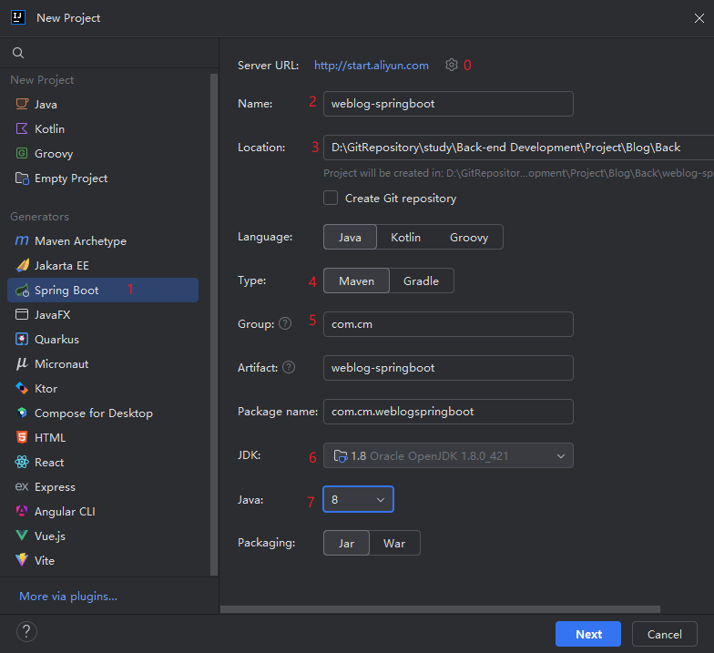
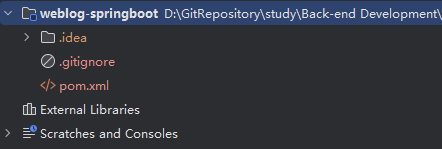
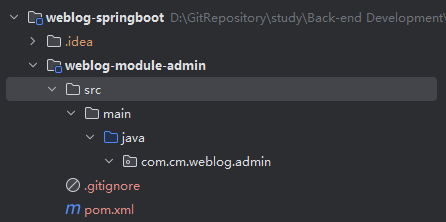
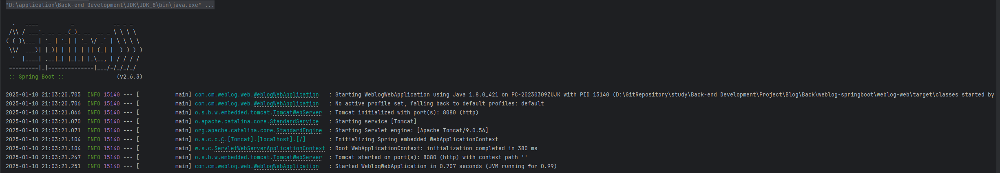

# 一、搭建Spring Boot 多模块工程(Spring Initializer)

## 1.1、IDEA搭建工程骨架



0. 通过设置修改初始化链接为阿里云：http://start.aliyun.com(否则无法使用Java8)
1. 选择 Spring Boot 项目初始化容器
2. 配置父项目名称
3. 选择项目存放位置
4. 选择Maven构建项目
5. 填写组织名称，通常为公司域名倒写
6. 选择JDK
7. 选择Java版本
8. Next -> create
9. 删除无用文件，最终目录如下：
   

10. 整理pom.xml

    - Spring Boot 版本切换成2.6.3

    - 项目信息

    - 多模块项目父工程打包模式必须指定为pom

    - 子模块管理

    - 版本号统一管理

    - 统一依赖管理

    - 统一插件管理

    - 配置阿里云的Maven镜像，提升下载速度

    - 最终代码如下：

      ```xml
      <?xml version="1.0" encoding="UTF-8"?>
      <project xmlns="http://maven.apache.org/POM/4.0.0" xmlns:xsi="http://www.w3.org/2001/XMLSchema-instance"
          xsi:schemaLocation="http://maven.apache.org/POM/4.0.0 https://maven.apache.org/xsd/maven-4.0.0.xsd">
          <modelVersion>4.0.0</modelVersion>
      
          <parent>
              <groupId>org.springframework.boot</groupId>
              <artifactId>spring-boot-starter-parent</artifactId>
              <version>2.6.3</version>
              <relativePath />
          </parent>
      
          <groupId>com.cm</groupId>
          <artifactId>weblog-springboot</artifactId>
          <version>${revision}</version>
          <name>weblog-springboot</name>
          <description>前后端分离博客项目</description>
      
          <!-- 多模块项目父工程打包模式必须指定为pom -->
          <packaging>pom</packaging>
      
          <!-- 子模块管理-->
          <modules></modules>
      
          <!-- 版本号统一管理 -->
          <properties>
              <!-- 项目版本号 -->
              <revision>0.0.1-SNAPSHOT</version>
              <java.version>1.8</java.version>
              <project.build.sourceEncoding>UTF-8</project.build.sourceEncoding>
      
              <!-- Maven 相关-->
              <maven.complier.source>${java.version}</maven.complier.source>
              <maven.complier.target>${java.version}</maven.complier.target>
          </properties>
      
          <!-- 统一依赖管理 -->
          <dependencyManagement>
      
          </dependencyManagement>
      
          <build>
              <!-- 统一插件管理 -->
              <pluginManagement>
      
              </pluginManagement>
          </build>
      
          <!-- 阿里云镜像 -->
          <repositories>
              <repository>
                  <id>aliyunmaven</id>
                  <name>aliyun</name>
                  <url>https://maven.aliyun.com/repository/public</url>
              </repository>
          </repositories>
      </project>
      ```

      

## 1.2、Web模块：入口模块

0. IDEA新建weblog-web子模块
1. 勾选lombok和Spring Web
2. 删除多余文件
3. 父项目pom.xml中添加该子模块及spring-boot-maven-plugin插件
4. 整理web模块的pom.xml，仅保留spring-boot-starter-web、lombok、spring-boot-starter-test依赖以及spring-boot-maven-plugin插件

## 1.3、Admin模块：后台管理功能模块

0. IDEA新建weblog-module-admin子模块
1. 勾选lombok
2. 删除多余文件
   
3. 父项目配置子模块
4. 整理pom.xml：lombok依赖和spring-boot-starter-test依赖

## 1.4、Common模块：通用功能模块

0. IDEA 新建weblog-module-common模块

1. 勾选lombok

2. 删除多余文件

3. 依赖：lombok、guava、spring-boot-starter-test

4. 父项目配置子模块、统一版本管理、配置依赖

5. 子模块之间的依赖关系：weblog-web依赖于weblog-module-common和weblog-module-admin、weblog-module-admin依赖于weblog-module-common

最终xml文件配置如下

- weblog-springboot:

  ```xml
  <?xml version="1.0" encoding="UTF-8"?>
  <project xmlns="http://maven.apache.org/POM/4.0.0" xmlns:xsi="http://www.w3.org/2001/XMLSchema-instance"
           xsi:schemaLocation="http://maven.apache.org/POM/4.0.0 https://maven.apache.org/xsd/maven-4.0.0.xsd">
      <modelVersion>4.0.0</modelVersion>
  
      <parent>
          <groupId>org.springframework.boot</groupId>
          <artifactId>spring-boot-starter-parent</artifactId>
          <version>2.6.3</version>
          <relativePath />
      </parent>
  
      <groupId>com.cm</groupId>
      <artifactId>weblog-springboot</artifactId>
      <version>${revision}</version>
      <name>weblog-springboot</name>
      <description>前后端分离博客项目</description>
  
      <packaging>pom</packaging>
  
      <!-- 子模块管理-->
      <modules>
          <!-- 入口模块 -->
          <module>weblog-web</module>
          <!-- Admin 后台管理功能模块 -->
          <module>weblog-module-admin</module>
          <!-- Common 通用功能模块 -->
          <module>weblog-module-common</module>
      </modules>
  
      <!-- 统一版本号管理-->
      <properties>
          <!-- 项目版本号-->
          <revision>0.0.1-SNAPSHOT</revision>
          <java.version>1.8</java.version>
          <project.build.sourceEncoding>UTF-8</project.build.sourceEncoding>
  
          <!-- Maven相关 -->
          <maven.complier.source>${java.version}</maven.complier.source>
          <maven.complier.target>${java.version}</maven.complier.target>
  
          <!-- 依赖包版本 -->
          <lombok.version>1.18.28</lombok.version>
          <guava.version>31.1-jre</guava.version>
          <commons-lang3.version>3.12.0</commons-lang3.version>
      </properties>
  
      <!-- 统一依赖管理-->
      <dependencyManagement>
          <dependencies>
              <dependency>
                  <groupId>com.cm</groupId>
                  <artifactId>weblog-module-admin</artifactId>
                  <version>${revision}</version>
              </dependency>
  
              <dependency>
                  <groupId>com.cm</groupId>
                  <artifactId>weblog-module-common</artifactId>
                  <version>${revision}</version>
              </dependency>
  
              <!-- 常用工具库 -->
              <dependency>
                  <groupId>com.google.guava</groupId>
                  <artifactId>guava</artifactId>
                  <version>${guava.version}</version>
              </dependency>
  
              <dependency>
                  <groupId>org.apache.commons</groupId>
                  <artifactId>commons-lang3</artifactId>
                  <version>${commons-lang3.version}</version>
              </dependency>
          </dependencies>
      </dependencyManagement>
  
      <build>
          <!-- 统一插件管理-->
          <pluginManagement>
              <plugins>
                  <plugin>
                      <groupId>org.springframework.boot</groupId>
                      <artifactId>spring-boot-maven-plugin</artifactId>
                      <configuration>
                          <excludes>
                              <exclude>
                                  <groupId>org.projectlombok</groupId>
                                  <artifactId>lombok</artifactId>
                              </exclude>
                          </excludes>
                      </configuration>
                  </plugin>
              </plugins>
          </pluginManagement>
      </build>
  
      <!-- 阿里云镜像-->
      <repositories>
          <repository>
              <id>aliyunmaven</id>
              <name>aliyun</name>
              <url>https://maven.aliyun.com/repository/public</url>
          </repository>
      </repositories>
  </project>
  ```

- weblog-web

  ```xml
  <?xml version="1.0" encoding="UTF-8"?>
  <project xmlns="http://maven.apache.org/POM/4.0.0" xmlns:xsi="http://www.w3.org/2001/XMLSchema-instance"
           xsi:schemaLocation="http://maven.apache.org/POM/4.0.0 https://maven.apache.org/xsd/maven-4.0.0.xsd">
      <modelVersion>4.0.0</modelVersion>
  
      <parent>
          <groupId>com.cm</groupId>
          <artifactId>weblog-springboot</artifactId>
          <version>${revision}</version>
      </parent>
  
      <groupId>com.cm</groupId>
      <artifactId>weblog-web</artifactId>
      <name>weblog-web</name>
      <description>weblog-web(入口项目，负责博客前台展示、打包也在这个模块负责)</description>
  
      <dependencies>
          <dependency>
              <groupId>com.cm</groupId>
              <artifactId>weblog-module-common</artifactId>
          </dependency>
  
          <dependency>
              <groupId>com.cm</groupId>
              <artifactId>weblog-module-admin</artifactId>
          </dependency>
  
          <dependency>
              <groupId>org.springframework.boot</groupId>
              <artifactId>spring-boot-starter-web</artifactId>
          </dependency>
  
          <dependency>
              <groupId>org.projectlombok</groupId>
              <artifactId>lombok</artifactId>
              <optional>true</optional>
          </dependency>
  
          <dependency>
              <groupId>org.springframework.boot</groupId>
              <artifactId>spring-boot-starter-test</artifactId>
              <scope>test</scope>
          </dependency>
      </dependencies>
  
      <build>
          <plugins>
              <plugin>
                  <groupId>org.springframework.boot</groupId>
                  <artifactId>spring-boot-maven-plugin</artifactId>
              </plugin>
          </plugins>
      </build>
  
  </project>
  ```

- weblog-admin

  ```xml
  <?xml version="1.0" encoding="UTF-8"?>
  <project xmlns="http://maven.apache.org/POM/4.0.0" xmlns:xsi="http://www.w3.org/2001/XMLSchema-instance"
           xsi:schemaLocation="http://maven.apache.org/POM/4.0.0 https://maven.apache.org/xsd/maven-4.0.0.xsd">
      <modelVersion>4.0.0</modelVersion>
  
      <parent>
          <groupId>com.cm</groupId>
          <artifactId>weblog-springboot</artifactId>
          <version>${revision}</version>
      </parent>
  
      <groupId>com.cm</groupId>
      <artifactId>weblog-module-admin</artifactId>
      <name>weblog-module-admin</name>
      <description>weblog-admin (负责管理后台相关功能)</description>
  
      <dependencies>
          <dependency>
              <groupId>com.cm</groupId>
              <artifactId>weblog-module-common</artifactId>
          </dependency>
  
          <dependency>
              <groupId>org.projectlombok</groupId>
              <artifactId>lombok</artifactId>
              <optional>true</optional>
          </dependency>
  
          <dependency>
              <groupId>org.springframework.boot</groupId>
              <artifactId>spring-boot-starter-test</artifactId>
              <scope>test</scope>
          </dependency>
      </dependencies>
  </project>
  ```

- weblog-common

  ```xml
  <?xml version="1.0" encoding="UTF-8"?>
  <project xmlns="http://maven.apache.org/POM/4.0.0" xmlns:xsi="http://www.w3.org/2001/XMLSchema-instance"
           xsi:schemaLocation="http://maven.apache.org/POM/4.0.0 https://maven.apache.org/xsd/maven-4.0.0.xsd">
      <modelVersion>4.0.0</modelVersion>
  
      <parent>
          <groupId>com.cm</groupId>
          <artifactId>weblog-springboot</artifactId>
          <version>${revision}</version>
      </parent>
  
      <groupId>com.cm</groupId>
      <artifactId>weblog-module-common</artifactId>
      <name>weblog-common</name>
      <description>weblog-common(存放一些通用的功能)</description>
  
      <dependencies>
          <dependency>
              <groupId>org.projectlombok</groupId>
              <artifactId>lombok</artifactId>
              <optional>true</optional>
          </dependency>
  
          <dependency>
              <groupId>org.springframework.boot</groupId>
              <artifactId>spring-boot-starter-test</artifactId>
              <scope>test</scope>
          </dependency>
      </dependencies>
  </project>
  ```

## 1.5、测试

> 在测试前要检查好IDEA中maven的配置

对weblog-springboot执行maven的clean、package命令(将跳过单元测试勾选上)

打包成功后会在weblog-web的target目录下生成weblog-web-0.0.1-SNAPSHOT.jar

**测试启动**

在weblog-web下找到启动类WeblogWebApplication运行main方法

**启动成功**



# 二、多环境配置

- dev：本地开发环境，兼顾测试，测试完成后直接上线
- prod：生产环境

在weblog-web/src/main/resources下新建：

- application.yml

  ```yml
  spring:
  	profiles:
  		# 默认激活dev环境
  		active: dev
  ```

- application-dev.yml

- application-prod.yml

# 三、整合Logback日志

> 由于 Spring Boot 默认使用 Logback，所以当你在 `pom.xml` 中加入 `spring-boot-starter-web` 依赖时，它会自动包含 Logback 相关依赖，无需额外添加

## 3.1、自定义Logback配置

在weblog-web/src/main/resources下新建logback-weblog.xml：

```xml
<?xml version="1.0" encoding="UTF-8" ?>
<configuration>
    <jmxConfigurator />
    <include resource="org/springframework/boot/logging/logback/defaults.xml" />

    <!-- 应用名称 -->
    <property scope="context" name="appName" value="weblog" />
    <!-- 自定义日志输出路径及日志名称前缀 -->
    <property name="LOG_FILE" value="/app/weblog/logs/${appName}.%d{yyyy-MM-dd}" />
    <!--<property name="LOG_FILE" value="D:\\GitRepository\\Project\\Blog\\Back\\weblog-springboot\\logs\\${appName}.%d{yyyy-MM-dd}"/>-->
    <!-- 格式化输出：%d 表示日期，%thread 表示线程名，%-5level：级别从左显示 5 个字符宽度 %logger{50}: 表示记录日志的类的名称（即日志记录器的名称）最多显示 50 个字符的类名，如果类名超过 50 个字符，它会截断 %msg：日志消息，%n 是换行符-->
    <property name="FILE_LOG_PATTERN" value="%d{yyyy-MM-dd HH:mm:ss:SSS} [%thread] %-5level %logger{50} - %msg%n" />

    <appender name="FILE" class="ch.qos.logback.core.rolling.RollingFileAppender">
        <rollingPolicy class="ch.qos.logback.core.rolling.TimeBasedRollingPolicy">
            <FileNamePattern>${LOG_FILE}-%i.log</FileNamePattern>
            <MaxHistory>30</MaxHistory>
            <TimeBasedFileNamingAndTriggeringPolicy class="ch.qos.logback.core.rolling.SizeAndTimeBasedFNATP">
                <maxFileSize>10MB</maxFileSize>
            </TimeBasedFileNamingAndTriggeringPolicy>
        </rollingPolicy>
        <encoder class="ch.qos.logback.classic.encoder.PatternLayoutEncoder">
            <pattern>${FILE_LOG_PATTERN}</pattern>
        </encoder>
    </appender>

    <!-- dev环境（仅输出到控制台）-->
    <springProfile name="dev">
        <include resource="org/springframework/boot/logging/logback/console-appender.xml" />
        <root level="INFO">
            <appender-ref ref="CONSOLE" />
        </root>
    </springProfile>

    <!-- prod环境（仅输出到控制台）-->
    <springProfile name="prod">
        <include resource="org/springframework/boot/logging/logback/console-appender.xml" />
        <root level="INFO">
            <appender-ref ref="FILE" />
        </root>
    </springProfile>
</configuration>
```

打印日志到文件只需在生产环境开启，所以在application-prod.yml中配置：

```yml
logging:
	config: classpath:logback-weblog.xml
```

## 3.2、测试

**测试dev环境**

在WeblogWebApplicationTests类中新建一个testLog()，并给类添加@Slf4j注解

```java
package com.cm.weblog.web;

import lombok.extern.slf4j.Slf4j;
import org.junit.jupiter.api.Test;
import org.springframework.boot.test.context.SpringBootTest;

@SpringBootTest
@Slf4j
class WeblogWebApplicationTests {

    @Test
    void contextLoads() {
    }

    @Test
    void testLog() {
        log.info("测试 INFO 日志");
        log.warn("测试 WARN 日志");
        log.error("测试 Error 日志");

        String author = "cm";
        log.info("测试占位符日志，作者：{}", author);
    }
}
```

**测试prod环境**

修改application.yml激活prod环境

修改logback-weblog.xml文件中的日志输出路径

```xml
<property name="LOG_FILE" value="D:\\GitRepository\\Project\\Blog\\Back\\weblog-springboot\\logs\\${appName}.%d{yyyy-MM-dd}"/>
```

> 测试完把环境及配置改回来

# 四、自定义注解实现API请求日志切面

## 4.1、什么是 AOP (面向切面编程)？

AOP（Aspect-Oriented Programming，面向切面编程）是一个编程范式，它提供了一种能力，让开发者能够模块化跨多个对象的横切关注点（例如日志、事务管理、安全等）。

主要概念包括：

- **切点 (Pointcuts)**: 定义在哪里应用切面（即在哪里插入横切关注点的代码）。
- **通知 (Advices)**: 定义在特定切点上要执行的代码。常见的通知类型有：前置通知、后置通知、环绕通知等。
- **切面 (Aspects)**: 切面将切点和通知结合起来，定义了在何处和何时应用特定的逻辑。

例如，使用AOP，我们可以为所有使用 `@ApiOperationLog` 注解的方法自动添加日志逻辑，而不需要在每个方法中手动添加。

## 4.2、添加依赖

在父项目 `weblog-springboot` 中的 `pom.xml` 文件中，添加 `jackson` 工具，它用于将出入参转为 `json` 字符串：

```xml
<!-- 版本号统一管理 -->
<properties>
    ...省略
    <jackson.version>2.15.2</jackson.version>
</properties>

<!-- 统一依赖管理 -->
    <dependencyManagement>
        <dependencies>
            ...省略

            <!-- Jackson -->
            <dependency>
                <groupId>com.fasterxml.jackson.core</groupId>
                <artifactId>jackson-databind</artifactId>
                <version>${jackson.version}</version>
            </dependency>

        </dependencies>
    </dependencyManagement>

```

因为日志切面属于前台、后台管理接口通用的功能，所以和该功能相关代码可以统一放置于 `weblog-module-common` 模块中。

打开 `weblog-module-common` 模块中的 `pom.xml` , 引用具体依赖：

```xml
<dependencies>
		...省略

		<!-- AOP 切面 -->
		<dependency>
			<groupId>org.springframework.boot</groupId>
			<artifactId>spring-boot-starter-aop</artifactId>
		</dependency>

		<!-- Jackson -->
		<dependency>
			<groupId>com.fasterxml.jackson.core</groupId>
			<artifactId>jackson-databind</artifactId>
		</dependency>
	</dependencies>
```

## 4.3、自定义ApiOperationLog注解

在 `weblog-module-common` 通用模块下，新建一个名为 `aspect` 的包，用于放置切面相关的功能类

接着，在其中创建一个名为 `ApiOperationLog` 的自定义注解

```java
package com.cm.weblog.common.aspect;

import java.lang.annotation.*;

/**
 * ClassName: ApiOperationLog
 * Package: com.cm.weblog.common.aspect
 * Description: 自定义切面注解
 *
 * @Version 1.0
 */
@Retention(RetentionPolicy.RUNTIME)
@Target({ElementType.METHOD})
@Documented
public @interface ApiOperationLog {
    // API 功能描述
    String description() default "";
}

```

元注解说明：

- `@Retention(RetentionPolicy.RUNTIME)`： 这个元注解用于指定注解的保留策略，即注解在何时生效。`RetentionPolicy.RUNTIME` 表示该注解将在运行时保留，这意味着它可以通过反射在运行时被访问和解析。
- `@Target({ElementType.METHOD})`： 这个元注解用于指定注解的目标元素，即可以在哪些地方使用这个注解。`ElementType.METHOD` 表示该注解只能用于方法上。这意味着您只能在方法上使用这个特定的注解。
- `@Documented`： 这个元注解用于指定被注解的元素是否会出现在生成的Java文档中。如果一个注解使用了 `@Documented`，那么在生成文档时，被注解的元素及其注解信息会被包含在文档中。这可以帮助文档生成工具（如 JavaDoc）在生成文档时展示关于注解的信息。

## 4.4、在创建切面类之前定义一个JSON工具类

在 `weblog-module-common` 通用模块下，创建一个 `utils` 包，用于统一放置工具类相关，然后，新建一个名为 `JsonUtil` 的工具类， 代码如下：

```java
package com.cm.weblog.common.utils;

import com.fasterxml.jackson.core.JsonProcessingException;
import com.fasterxml.jackson.databind.ObjectMapper;
import lombok.extern.slf4j.Slf4j;

/**
 * ClassName: JsonUtil
 * Package: com.cm.weblog.common.utils
 * Description: JSON 工具类
 *
 * @Version 1.0
 */
@Slf4j
public class JsonUtil {
    private static final ObjectMapper INSTANCE = new ObjectMapper();

    public static String toJsonString(Object obj) {
        try {
            return INSTANCE.writeValueAsString(obj);
        } catch (JsonProcessingException e) {
            return obj.toString();
        }
    }
}
```

## 4.5、定义日志切面类

工具类搞定后，在 `aspect` 包下，新建切面类 `ApiOperationLogAspect` , 代码如下，附有详细注释：

```java
package com.cm.weblog.common.aspect;

import com.cm.weblog.common.utils.JsonUtil;
import lombok.extern.slf4j.Slf4j;
import org.aspectj.lang.ProceedingJoinPoint;
import org.aspectj.lang.annotation.Around;
import org.aspectj.lang.annotation.Aspect;
import org.aspectj.lang.annotation.Pointcut;
import org.aspectj.lang.reflect.MethodSignature;
import org.slf4j.MDC;
import org.springframework.stereotype.Component;

import java.lang.reflect.Method;
import java.util.Arrays;
import java.util.UUID;
import java.util.function.Function;
import java.util.stream.Collectors;

/**
 * ClassName: ApiOperationLogAspect
 * Package: com.cm.weblog.common.aspect
 * Description: 自定义日志切面类
 *
 * @Version 1.0
 */
@Aspect
@Component
@Slf4j
public class ApiOperationLogAspect {
    /*
    * 以自定义注解 ApiOperationLog 为切点
    * 凡是添加@ ApiOperationLog 的方法都会执行环绕中的代码
    * */
    @Pointcut("@annotation(com.cm.weblog.common.aspect.ApiOperationLog)")
    public void apiOperationLog() {}

    @Around("apiOperationLog()")
    public Object doAround(ProceedingJoinPoint joinPoint) throws Throwable {
        long startTime = System.currentTimeMillis();

        // 获取请求的类和方法
        String className = joinPoint.getTarget().getClass().getSimpleName();
        String methodName = joinPoint.getSignature().getName();

        // 获取请求入参
        Object[] args = joinPoint.getArgs();
        // 转成JSON
        String argsJsonStr = Arrays.stream(args).map(toJsonString()).collect(Collectors.joining(", "));

        // 获取功能描述信息
        String description = getApiOperationLogDescription(joinPoint);

        // 打印入参信息
        log.info("====== 请求开始: [{}], 入参: {}, 请求类: {}, 请求方法: {} =================================== ",
                description, argsJsonStr, className, methodName);

        // 执行切点方法
        Object result = joinPoint.proceed();

        // 执行耗时
        long executionTime = System.currentTimeMillis() - startTime;

        // 打印出参等相关信息
        log.info("====== 请求结束: [{}], 耗时: {}ms, 出参: {} =================================== ",
                description, executionTime, JsonUtil.toJsonString(result));

        return result;
    }

    /**
     * 转 JSON 字符串
     * @return JSON
     */
    private Function<Object, String> toJsonString() {
        return arg -> JsonUtil.toJsonString(arg);
    }

    private String getApiOperationLogDescription(ProceedingJoinPoint joinPoint) {
        // 获取 MethodSignature
        MethodSignature methodSignature = (MethodSignature) joinPoint.getSignature();

        // 获取被注解的 Method
        Method method = methodSignature.getMethod();

        // 获取注解
        ApiOperationLog annotation = method.getAnnotation(ApiOperationLog.class);

        // 获取 description 属性
        return annotation.description();
    }
}

```

**aspectj 注解说明**

- **@Aspect**：声明该类为一个切面类；
- **@Pointcut**：定义一个切点，后面跟随一个表达式，表达式可以定义为切某个注解，也可以是某个 package 下的方法；

切点定义好后，就是围绕这个切点做文章了：

- **@Before**: 在切点之前，织入相关代码；
- **@After**: 在切点之后，织入相关代码;
- **@AfterReturning**: 在切点返回内容后，织入相关代码，一般用于对返回值做些加工处理的场景；
- **@AfterThrowing**: 用来处理当织入的代码抛出异常后的逻辑处理;
- **@Around**: 环绕，可以在切入点前后织入代码，并且可以自由的控制何时执行切点；

## 4.6、添加包扫描

在启动类 `WeblogWebApplication` 中，手动添加包扫描 `@ComponentScan` , 指定扫描 `com.cm.weblog` 包下面的所有类:

```java
@ComponentScan({"com.cm.weblog.*"}) // 多模块项目中，必需手动指定扫描 com.cm.weblog 包下面的所有类
```

## 4.7、新增测试接口

1. 在 `weblog-web`下新增包 `controller` 和 `model`
2. `model` 包下新增User模型 

```java
package com.cm.weblog.web.model;

import lombok.Data;

/**
 * ClassName: User
 * Package: com.cm.weblog.web.model
 * Description: 用户对象模型
 *
 * @Version 1.0
 */
@Data
public class User {
    private String username;
    private Integer sex;
}
```

3. controll包下新增TestController类并新增一个测试接口

```java
package com.cm.weblog.web.controller;

import com.cm.weblog.common.aspect.ApiOperationLog;
import com.cm.weblog.web.model.User;
import lombok.extern.slf4j.Slf4j;
import org.springframework.web.bind.annotation.PostMapping;
import org.springframework.web.bind.annotation.RequestBody;
import org.springframework.web.bind.annotation.RestController;

/**
 * ClassName: TestController
 * Package: com.cm.weblog.web.controller
 * Description: 测试请求
 *
 * @Version 1.0
 */
@RestController
@Slf4j
public class TestController {
    @PostMapping("/test")
    @ApiOperationLog(description = "测试接口")
    public User test(@RequestBody User user) {
        return user;
    }
}
```

4. ApiFox 测试通过

# 五、Spring Boot 通过 MDC 实现日志跟踪


本小节中，我们将在 Spring Boot 中通过 MDC 实现日志追踪功能。

## 5.1、什么是 MDC ? 为什么需要它？

MDC（Mapped Diagnostic Context）是 SLF4J 和 log4j 等日志框架提供的一种方案，它允许开发者将一些特定的数据（如用户ID、请求ID等）存储到当前线程的上下文中，使得这些数据可以在日志消息中使用。这对于跟踪多线程或高并发应用中的单个请求非常有用。

**在高并发环境中，由于多个请求可能同时处理，日志消息可能会交错在一起**。使用MDC，我们可以*为每个请求分配一个唯一的标识，并将该标识添加到每条日志消息中，从而方便地区分和跟踪每个请求的日志*。

## 5.2、开始动手

### 日志切面中设置 MDC 值

编辑 `ApiOperationLogAspect` 日志切面类，在 `doAround()` 方法中处理请求开始的时候, 将请求的跟踪标识放入MDC 中：

```less
// 处理请求开始的时候, 将请求的跟踪标识放入MDC 中，traceId 表示跟踪 ID， 值这里直接用的 UUID
MDC.put("traceId", UUID.randomUUID().toString());
```

### 配置日志框架

在 `logback-weblog.xml` 配置文件中，可以使用 `%X` 来引用MDC中的值。例如，要引用上述的 `traceId`，你可以这样配置：

``` xml
[TraceId: %X{traceId}] %d{yyyy-MM-dd HH:mm:ss.SSS} [%thread] %-5level %logger{50} - %msg%n
```

完整内容如下 ：

> ⚠️ 注意，这里日志输出路径改成了 Windows 系统路径，目的是为了等下测试日志是否能够正常输出 `traceId` 。

```xml
<?xml version="1.0" encoding="UTF-8" ?>
<configuration>
    <jmxConfigurator />
    <include resource="org/springframework/boot/logging/logback/defaults.xml" />

    <!-- 应用名称 -->
    <property scope="context" name="appName" value="weblog" />
    <!-- 自定义日志输出路径及日志名称前缀 -->
    <!--<property name="LOG_FILE" value="/app/weblog/logs/${appName}.%d{yyyy-MM-dd}" />-->
    <property name="LOG_FILE" value="D:\\GitRepository\\Project\\Blog\\Back\\weblog-springboot\\logs\\${appName}.%d{yyyy-MM-dd}"/>
    <!-- 格式化输出：%d 表示日期，%thread 表示线程名，%-5level：级别从左显示 5 个字符宽度 %logger{50}: 表示记录日志的类的名称（即日志记录器的名称）最多显示 50 个字符的类名，如果类名超过 50 个字符，它会截断 %msg：日志消息，%n 是换行符-->
    <property name="FILE_LOG_PATTERN" value="[TraceId: %X{traceId}] %d{yyyy-MM-dd HH:mm:ss:SSS} [%thread] %-5level %logger{50} - %msg%n" />

    <appender name="FILE" class="ch.qos.logback.core.rolling.RollingFileAppender">
        <rollingPolicy class="ch.qos.logback.core.rolling.TimeBasedRollingPolicy">
            <FileNamePattern>${LOG_FILE}-%i.log</FileNamePattern>
            <MaxHistory>30</MaxHistory>
            <TimeBasedFileNamingAndTriggeringPolicy class="ch.qos.logback.core.rolling.SizeAndTimeBasedFNATP">
                <maxFileSize>10MB</maxFileSize>
            </TimeBasedFileNamingAndTriggeringPolicy>
        </rollingPolicy>
        <encoder class="ch.qos.logback.classic.encoder.PatternLayoutEncoder">
            <pattern>${FILE_LOG_PATTERN}</pattern>
        </encoder>
    </appender>

    <!-- dev环境（仅输出到控制台）-->
    <springProfile name="dev">
        <include resource="org/springframework/boot/logging/logback/console-appender.xml" />
        <root level="INFO">
            <appender-ref ref="CONSOLE" />
        </root>
    </springProfile>

    <!-- prod环境（仅输出到控制台）-->
    <springProfile name="prod">
        <include resource="org/springframework/boot/logging/logback/console-appender.xml" />
        <root level="INFO">
            <appender-ref ref="FILE" />
        </root>
    </springProfile>
</configuration>
```

### 清除 MDC 值

在请求结束时，为了避免污染其他请求，还需要清除 MDC 中的值：

```scss
MDC.clear();
```

### 与 AOP 切面结合

所以，`ApiOperationLogAspect` 切面类中需添加的代码如下：

```java
 /**
     * 环绕
     * @param joinPoint
     * @return
     * @throws Throwable
     */
    @Around("apiOperationLog()")
    public Object doAround(ProceedingJoinPoint joinPoint) throws Throwable {
        try {
            MDC.put("traceId", UUID.randomUUID().toString());

            ... 省略
        } finally {
            MDC.clear();
        }
    }
```

## 5.3、测试看看

我们将 `application.yml` 中的 `profile` 改为 `prod` 环境，来测试一波日志文件是否含有 `traceId`。 重启项目，再次请求 `/test` 接口，然后查看日志：


可以看到请求日志中正确打印了 `traceId` ，有了它，就可以在查询日志的时候通过 `traceId` 来过滤出同一个请求的所有日志了。

# 六、参数校验

## 6.1、前言

在日常的 Web 开发中，请求参数校验是一个非常基础且重要的环节。通过校验，我们可以确保每次接口请求中，入参的数据是有效、安全且合规的，避免数据库中出现脏数据。

## 6.2、手动校验参数

原始的手动校验参数代码如下：

```less
	@PostMapping("/test")
    @ApiOperationLog(description = "测试接口")
    public ResponseEntity<String> test(@RequestBody User user) {
        // 参数校验
        if (user.getName() == null || user.getName().trim().isEmpty()) {
            return ResponseEntity.badRequest().body("姓名不能为空");
        }

        if (user.getAge() < 18 || user.getAge() > 100) {
            return ResponseEntity.badRequest().body("年龄必须在18到100之间");
        }

        if (user.getEmail() == null || !isValidEmail(user.getEmail())) {
            return ResponseEntity.badRequest().body("邮箱格式不正确");
        }

        // 更多的校验...

        // 返参
        return ResponseEntity.ok("参数没有任何问题");
    }
```

这还是只有 3 个字段需要校验的情况，如果更多呢？一堆的 `if else` 是不是又臭又长！有没有什么优雅的解决方案呢？

## JSR 380 参数校验注解

Spring Boot 提供了简洁的方法，让我们能够利用 Java 校验 API (JSR 380) 中定义的注解进行参数校验。JSR 380，也被称为 Bean Validation 2.0，是 Java Bean 验证规范的一个版本。该规范定义了一系列注解，用于验证 Java Bean 对象的属性，确保它们满足某些条件或限制。

以下是 JSR 380 中提供的主要验证注解及其描述：

1. **@NotNull**: 验证对象值不应为 null。
2. **@AssertTrue**: 验证布尔值是否为 true。
3. **@AssertFalse**: 验证布尔值是否为 false。
4. **@Min(value)**: 验证数字是否不小于指定的最小值。
5. **@Max(value)**: 验证数字是否不大于指定的最大值。
6. **@DecimalMin(value)**: 验证数字值（可以是浮点数）是否不小于指定的最小值。
7. **@DecimalMax(value)**: 验证数字值（可以是浮点数）是否不大于指定的最大值。
8. **@Positive**: 验证数字值是否为正数。
9. **@PositiveOrZero**: 验证数字值是否为正数或零。
10. **@Negative**: 验证数字值是否为负数。
11. **@NegativeOrZero**: 验证数字值是否为负数或零。
12. **@Size(min, max)**: 验证元素（如字符串、集合或数组）的大小是否在给定的最小值和最大值之间。
13. **@Digits(integer, fraction)**: 验证数字是否在指定的位数范围内。例如，可以验证一个数字是否有两位整数和三位小数。
14. **@Past**: 验证日期或时间是否在当前时间之前。
15. **@PastOrPresent**: 验证日期或时间是否在当前时间或之前。
16. **@Future**: 验证日期或时间是否在当前时间之后。
17. **@FutureOrPresent**: 验证日期或时间是否在当前时间或之后。
18. **@Pattern(regexp)**: 验证字符串是否与给定的正则表达式匹配。
19. **@NotEmpty**: 验证元素（如字符串、集合、Map 或数组）不为 null，并且其大小/长度大于0。
20. **@NotBlank**: 验证字符串不为 null，且至少包含一个非空白字符。
21. **@Email**: 验证字符串是否符合有效的电子邮件格式。

除了上述的标准注解，JSR 380 也支持开发者定义和使用自己的自定义验证注解。此外，这个规范还提供了一系列的APIs和工具，用于执行验证和处理验证结果。大部分现代Java框架（如 Spring 和 Jakarta EE）都与 JSR 380 兼容，并支持其验证功能。

## 开始动手

本小节中，小哈将介绍如何在 `weblog` 项目中通过 JSR 380 实现参数校验功能。

### 引入依赖

首先，我们需要在 `weblog-web` 模块中的 `pom.xml` 文件添加参数校验依赖：

```php-template
<dependency>
    <groupId>org.springframework.boot</groupId>
    <artifactId>spring-boot-starter-validation</artifactId>
</dependency>
```

### 实体类参数校验

[上小节](https://www.quanxiaoha.com/column/10009.html#%E6%96%B0%E5%A2%9E%E6%B5%8B%E8%AF%95%E6%8E%A5%E5%8F%A3) 中，为了测试日志切面，我们已经新增了一个用户 `User` 实体类，这次再多添加两个字段，用于测试参数校验，代码如下：

```less
package com.quanxiaoha.weblog.web.model;

import lombok.Data;

import javax.validation.constraints.*;

/**
 * @author: 犬小哈
 * @url: www.quanxiaoha.com
 * @date: 2023-08-10 10:35
 * @description: TODO
 **/
@Data
public class User {
    // 用户名
    @NotBlank(message = "用户名不能为空") // 注解确保用户名不为空
    private String username;
    // 性别
    @NotNull(message = "性别不能为空") // 注解确保性别不为空
    private Integer sex;

    // 年龄
    @NotNull(message = "年龄不能为空")
    @Min(value = 18, message = "年龄必须大于或等于 18")  // 注解确保年龄大于等于 18
    @Max(value = 100, message = "年龄必须小于或等于 100")  // 注解确保年龄小于等于 100
    private Integer age;

    // 邮箱
    @NotBlank(message = "邮箱不能为空")
    @Email(message = "邮箱格式不正确")  // 注解确保邮箱格式正确
    private String email;
}
```

上述代码说明：

- `@NotBlank`: 此注解确保字符串不为空并且不能为空字符串，且去掉前后空格后的长度必须大于 0。它常用于字符串字段验证。`message` 属性用于指定提示信息；
- `@NotNull`: 此注解确保整数类型不能为 `null`；
- `@Min` 和 `@Max`: 这两个注解用于验证数字值是否在指定的范围内。例如，在上面的示例中，我们想要确保 `age` 的值在 18 到 100 之间；
- `@Email`: 此注解用于验证字符串值是否是有效的电子邮件地址格式。

### Controller 参数校验

针对每个字段的校验注解添加完成后，还需要在 `controller` 层进行捕获，并将错误信息返回。编辑 `TestController` 类，代码如下：

```kotlin
@RestController
@Slf4j
public class TestController {

    @PostMapping("/test")
    @ApiOperationLog(description = "测试接口")
        public ResponseEntity<String> test(@RequestBody @Validated User user, BindingResult bindingResult) {
        // 是否存在校验错误
        if (bindingResult.hasErrors()) {
            // 获取校验不通过字段的提示信息
            String errorMsg = bindingResult.getFieldErrors()
                    .stream()
                    .map(FieldError::getDefaultMessage)
                    .collect(Collectors.joining(", "));

            return ResponseEntity.badRequest().body(errorMsg);
        }

        // 返参
        return ResponseEntity.ok("参数没有任何问题");
    }

}
```

解释一下上面代码中的关键部分：

- `@Validated`: 告诉 Spring 需要对 `User` 对象执行校验;
- `BindingResult` : 验证的结果对象，其中包含所有验证错误信息；

### 测试一下效果

使用 Postman 工具请求 `/test` 接口测试一下，请求入参如下：

#### 入参正确的情况

入参：

```perl
{
    "username": "犬小哈",
    "sex": 1,
    "age": 32,
    "email": "123124@qq.com"
}
```


#### 入参不正确的情况

入参数据：

```json
{
    "username": "",
    "sex": null,
    "age": 120,
    "email": "123124qq.com"
}
```


可以看到，在字段不符合校验规则的情况下，正确返回了每个字段的提示信息。参数校验功能正常执行。

## 还不够优雅？

虽然实现了以添加注解的方式搞定了参数校验功能，但是 `controller` 层的代码也太不优雅美观了：


总不能每次定义一个接口，都要写上面这么一坨吧！*别急，后面小节中，我们将通过自定义响应工具类 + 全局异常管理来干掉这一坨丑陋的代码，无需再手动返回。*